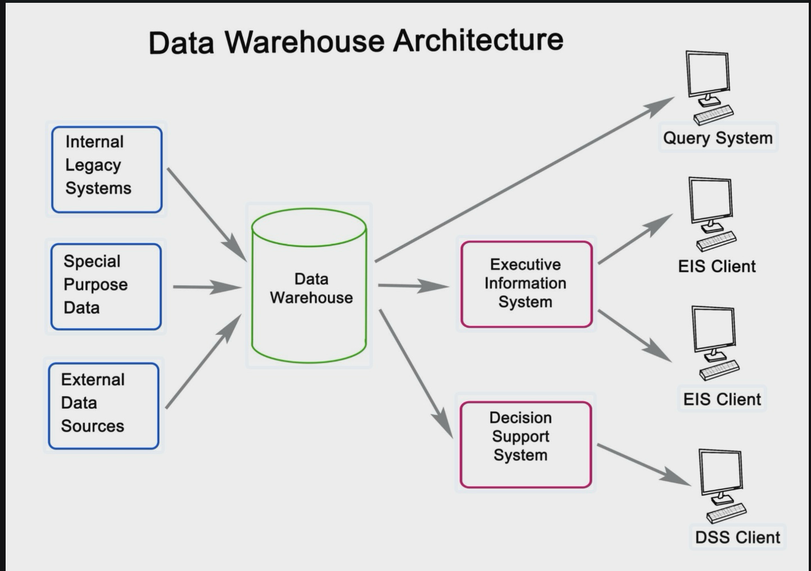

This is a diagram showcasing the architecture of a data warehouse system, a centralized repository for data from various sources, used for reporting and analysis. The architecture is illustrated with data sources on the left, the data warehouse in the center, processing systems in the center-right, and client systems on the right. The diagram shows how data flows from the sources to the clients, with arrows indicating the direction of data flow.
Internal Legacy Systems
Special Purpose Data
External Data Sources
Data Warehouse
Executive Information System
Decision Support System
Query System
EIS Client
DSS Client